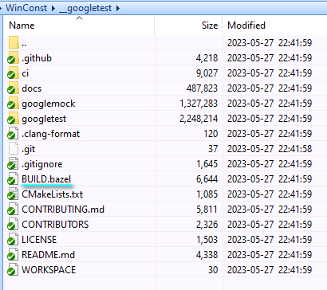
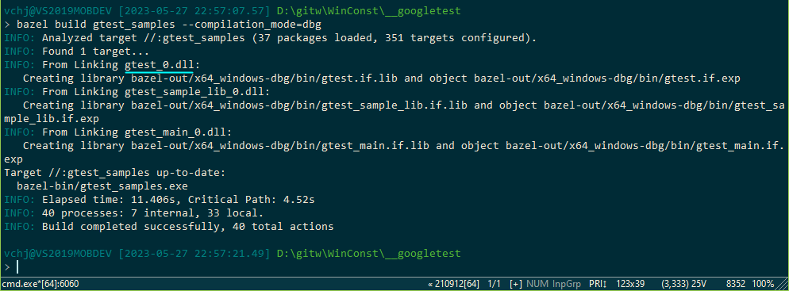
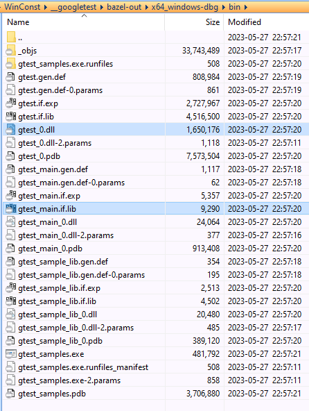
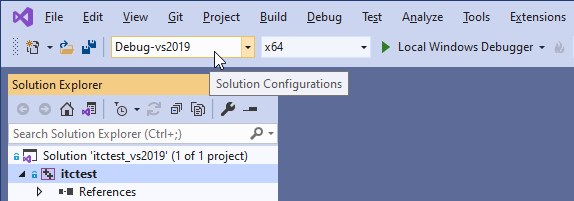

# 如何编译 WinConst 自测程序?

## 需要准备的软件

- git 2.34 命令行工具
- Visual Studio 2019 with Desktop C++ workload
- Bazel 6.1.2 for Windows

## 操作步骤


### WinConst Git 仓库准备

假定将此仓库克隆到本机硬盘的 d:\gitw\WinConst 目录中, 下方用 $ 代表此目录以便让路径显得简短.

此 Git 仓库含有一个 git submodule, 名曰 googletest, 需要将此子模块 update 出来. 该子模块将出现于 $\__googletest 子目录中.

获取子模块的命令如下:

```
D:\gitw\WinConst
> git submodule update
```



注意其中有 `BUILD.bazel` 文件, 这是 GoogleTest 的 Bazel 工程文件.


### 用 Bazel 编译出 GoogleTest 函数库

先确保 bazel.exe 处于 PATH 中, 以便我们随时能运行之.

用如下两个命令启动 GoogleTest 函数库的编译.

编译 x64 Debug 库:

```
D:\gitw\WinConst\__googletest
> bazel build gtest_samples --compilation_mode=dbg
```

由于 `gtest_samples` 这个目标在 `BUILD.bazel` 中被定义为 `cc_test` 类型, 因此, 该命令除了生成 GoogleTest 函数库, 同时也生成了一些范例程序.

bazel 命令完成编译的画面如下:



编译生成文件, 处于 $\__googletest\bazel-out\\**x64_windows-dbg**\bin 目录中:



其中有两个文件是稍后 WinConst 自测程序必须用到的:

- gtest_0.dll 动态库形式的 GoogleTest 和 GoogleMock 函数库.
- gtest.if.lib 这是 gtest_0.dll 对应的导入库. 

将以上输出留在原处, 再敲一个命令编出 x86 Debug 库（关键在 `--cpu=x64_x86_windows`）.

```
D:\gitw\WinConst\__googletest
> bazel build gtest_samples --compilation_mode=dbg --cpu=x64_x86_windows
```

这回输出文件处于目录 $\__googletest\bazel-out\\**x64_x86_windows-dbg**\bin , 其中的文件名则跟 x64_windows-dbg\bin 中的一致.


### 编译 WinConst 自测工程

显然, WinConst 自测工程用到了 GoogleTest 提供的函数.

用 Visual Studio 2019 打开 $\itctest\itctest_vs2019.sln , BuildConf 选择 [Debug-vs2019 | x64 ].



顺利的话, itctest.exe 应该构建成功且运行成功, itctest.exe 被生成到了 $\__googletest\bazel-out\\**x64_x86_windows-dbg**\bin 目录中, 跟 gtest_0.dll 并排, 这样的话, itctest.exe 运行时才能自动找到 gtest_0.dll .

将 BuildConf 切换为 [Debug-vs2019 | x86 ] 也应该成功, 此份 itctest.exe 则跟 x86 的那份 gtest_0.dll 并排 .


## $\itctest\itctest.vcxproj 中的特殊设置.

根据 $(Platform) 的不同, 设置了 $(gtestBinDir) 变量. 且, 将 itctest 的 $(OutDir) 设置为 $(gtestBinDir) .

```
  <PropertyGroup Condition="!$(Configuration.EndsWith('-gcc'))">
    
    <gtestBinDir Condition="'$(Platform)'=='Win32'">..\__googletest\bazel-out\x64_x86_windows-dbg\bin</gtestBinDir>
    <gtestBinDir Condition="'$(Platform)'=='x64'"  >..\__googletest\bazel-out\x64_windows-dbg\bin</gtestBinDir>
    
    <OutDir>$(gtestBinDir)\</OutDir>
  </PropertyGroup>
```

Include 搜索目录添加 gtest 和 gmock 目录.

```
      <AdditionalIncludeDirectories>.;../__googletest/googletest/include;../__googletest/googlemock/include;;$(AdditionalIncludeDirectories)</AdditionalIncludeDirectories>
```

库搜索路径(`AdditionalLibraryDirectories`) 添加 `$(gtestBinDir)` .

链接库名称添加(`AdditionalDependencies`) `gtest.if.lib` .

要求 itctest.exe 使用 DLL 版本的 MSVCRT (`/MDd`) .

